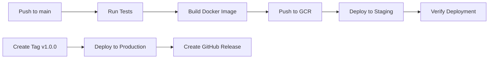
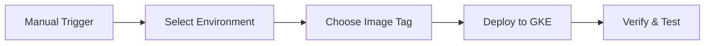

# 🚀 GitHub Actions Setup for GKE Deployment

This guide will help you set up GitHub Actions to automatically deploy your job scheduler application to Google Kubernetes Engine (GKE).

## 📋 Prerequisites

### 1. **GCP Setup**
- Google Cloud Platform project with billing enabled
- GKE cluster running
- Service account with necessary permissions
- Container Registry (GCR) enabled

### 2. **GitHub Repository**
- Repository with your scheduler app code
- Access to repository settings and secrets
- GitHub Actions enabled

## 🔐 Required GitHub Secrets

You'll need to add these secrets in your GitHub repository:

### **GCP Configuration**
```bash
GCP_PROJECT_ID          # Your GCP project ID
GKE_CLUSTER_NAME        # Your GKE cluster name
GKE_ZONE                # Your GKE cluster zone (e.g., us-central1-a)
GCP_SA_KEY              # Service account key JSON (base64 encoded)
```

### **Application Secrets**
```bash
JWT_TOKEN               # JWT token for authentication
AIRCALL_API_TOKEN       # Aircall API token (if needed)
```

## 🔧 Setting Up GCP Service Account

### 1. **Create Service Account**
```bash
# Create service account
gcloud iam service-accounts create github-actions \
  --display-name="GitHub Actions Service Account"

# Get your project ID
PROJECT_ID=$(gcloud config get-value project)

# Set service account email
SA_EMAIL="github-actions@$PROJECT_ID.iam.gserviceaccount.com"
```

### 2. **Assign Required Roles**
```bash
# Grant necessary permissions
gcloud projects add-iam-policy-binding $PROJECT_ID \
  --member="serviceAccount:$SA_EMAIL" \
  --role="roles/container.developer"

gcloud projects add-iam-policy-binding $PROJECT_ID \
  --member="serviceAccount:$SA_EMAIL" \
  --role="roles/storage.admin"

gcloud projects add-iam-policy-binding $PROJECT_ID \
  --member="serviceAccount:$SA_EMAIL" \
  --role="roles/iam.serviceAccountUser"
```

### 3. **Create and Download Key**
```bash
# Create service account key
gcloud iam service-accounts keys create ~/github-actions-key.json \
  --iam-account=$SA_EMAIL

# Base64 encode the key for GitHub
cat ~/github-actions-key.json | base64
```

### 4. **Add to GitHub Secrets**
Copy the base64 encoded output and add it as `GCP_SA_KEY` in your GitHub repository secrets.

## 🚀 Workflow Overview

### **1. Main Deployment Workflow (`deploy.yml`)**
- **Triggers**: Push to main/master, tags, manual dispatch
- **Jobs**:
  - `test`: Runs tests and builds
  - `build-and-push`: Builds and pushes Docker image to GCR
  - `deploy-staging`: Deploys to staging on main/master push
  - `deploy-production`: Deploys to production on version tags

### **2. Pull Request Workflow (`pr-check.yml`)**
- **Triggers**: Pull requests and pushes to main/master
- **Jobs**:
  - `validate`: Runs tests, linting, and validation
  - `security`: Security scans and dependency checks

### **3. Manual Deployment Workflow (`manual-deploy.yml`)**
- **Triggers**: Manual workflow dispatch
- **Features**: Deploy to any environment with custom image tags

## 🔄 Deployment Flow

### **Automatic Deployment**


### **Manual Deployment**


## 📝 Setting Up GitHub Secrets

### 1. **Go to Repository Settings**
- Navigate to your GitHub repository
- Click **Settings** tab
- Click **Secrets and variables** → **Actions**

### 2. **Add Required Secrets**
Click **New repository secret** for each:

| Secret Name | Value | Description |
|-------------|-------|-------------|
| `GCP_PROJECT_ID` | `your-project-id` | Your GCP project ID |
| `GKE_CLUSTER_NAME` | `your-cluster-name` | Your GKE cluster name |
| `GKE_ZONE` | `us-central1-a` | Your GKE cluster zone |
| `GCP_SA_KEY` | `base64-encoded-json` | Service account key |
| `JWT_TOKEN` | `your-jwt-token` | JWT authentication token |
| `AIRCALL_API_TOKEN` | `your-aircall-token` | Aircall API token |

### 3. **Environment Protection Rules**
For production deployments, set up environment protection:

1. Go to **Settings** → **Environments**
2. Create `production` environment
3. Add protection rules:
   - **Required reviewers**: Add team members who must approve
   - **Wait timer**: Optional delay before deployment
   - **Deployment branches**: Restrict to specific branches

## 🧪 Testing the Setup

### 1. **Test Pull Request Checks**
```bash
# Create a new branch
git checkout -b test-github-actions

# Make a small change
echo "# Test" >> README.md

# Commit and push
git add README.md
git commit -m "Test GitHub Actions"
git push origin test-github-actions

# Create PR on GitHub
```

### 2. **Test Manual Deployment**
1. Go to **Actions** tab in your repository
2. Click **Manual Deploy** workflow
3. Click **Run workflow**
4. Select environment and parameters
5. Click **Run workflow**

### 3. **Test Automatic Deployment**
```bash
# Push to main branch
git checkout main
git merge test-github-actions
git push origin main
```

## 🔍 Monitoring Deployments

### **GitHub Actions Dashboard**
- **Actions** tab: View all workflow runs
- **Environments**: Monitor deployment status
- **Artifacts**: Download build artifacts

### **GKE Monitoring**
```bash
# Check deployment status
kubectl get pods -n scheduler-app

# View logs
kubectl logs -f -n scheduler-app deployment/job-scheduler

# Check service
kubectl get svc -n scheduler-app
```

### **GCP Console**
- **Kubernetes Engine**: Monitor cluster health
- **Container Registry**: View pushed images
- **IAM & Admin**: Check service account permissions

## 🔧 Troubleshooting

### **Common Issues**

#### 1. **Authentication Failures**
```bash
# Check service account permissions
gcloud projects get-iam-policy $PROJECT_ID \
  --flatten="bindings[].members" \
  --filter="bindings.members:$SA_EMAIL" \
  --format="table(bindings.role)"
```

#### 2. **Image Push Failures**
```bash
# Verify Docker authentication
gcloud auth configure-docker

# Check GCR permissions
gsutil ls gs://artifacts.$PROJECT_ID.appspot.com/
```

#### 3. **Deployment Failures**
```bash
# Check pod events
kubectl describe pod -n scheduler-app -l app=job-scheduler

# Check pod logs
kubectl logs -n scheduler-app deployment/job-scheduler --previous
```

#### 4. **Network Policy Issues**
```bash
# Check if network policies are enabled
kubectl get networkpolicy -n scheduler-app

# Test connectivity
kubectl exec -n scheduler-app deployment/job-scheduler -- nslookup slack-kpi-service.slack-kpi-service.svc.cluster.local
```

### **Debug Workflows**
```bash
# Enable debug logging
# Add this to your workflow:
env:
  ACTIONS_STEP_DEBUG: true
  ACTIONS_RUNNER_DEBUG: true
```

## 📊 Best Practices

### **1. Security**
- Use least-privilege service accounts
- Rotate service account keys regularly
- Enable environment protection rules
- Scan for secrets in code

### **2. Reliability**
- Use specific image tags, not `latest`
- Implement health checks and rollbacks
- Monitor deployment success rates
- Set up alerting for failures

### **3. Performance**
- Use Docker layer caching
- Optimize Dockerfile for faster builds
- Use GitHub Actions cache for dependencies
- Parallelize jobs where possible

### **4. Monitoring**
- Set up log aggregation
- Monitor resource usage
- Track deployment metrics
- Alert on critical failures

## 🚀 Advanced Features

### **1. Multi-Environment Deployments**
```yaml
# Deploy to multiple environments
- name: Deploy to environments
  run: |
    for env in staging production; do
      kubectl apply -f k8s/$env/
    done
```

### **2. Blue-Green Deployments**
```yaml
# Implement blue-green deployment
- name: Deploy new version
  run: |
    kubectl apply -f k8s/deployment-v2.yaml
    
- name: Switch traffic
  run: |
    kubectl patch svc job-scheduler-service -p '{"spec":{"selector":{"version":"v2"}}}'
```

### **3. Canary Deployments**
```yaml
# Deploy to subset of pods
- name: Deploy canary
  run: |
    kubectl apply -f k8s/canary-deployment.yaml
    
- name: Monitor canary
  run: |
    kubectl rollout status deployment/job-scheduler-canary -n scheduler-app
```

## 📚 Additional Resources

### **GitHub Actions Documentation**
- [GitHub Actions Documentation](https://docs.github.com/en/actions)
- [Workflow Syntax](https://docs.github.com/en/actions/using-workflows/workflow-syntax-for-github-actions)
- [Environments](https://docs.github.com/en/actions/deployment/targeting-different-environments)

### **GKE Documentation**
- [GKE Quickstart](https://cloud.google.com/kubernetes-engine/docs/quickstart)
- [GKE Best Practices](https://cloud.google.com/kubernetes-engine/docs/best-practices)

### **Kubernetes Documentation**
- [Kubernetes Concepts](https://kubernetes.io/docs/concepts/)
- [kubectl Reference](https://kubernetes.io/docs/reference/kubectl/)

## 🎯 Next Steps

After setting up GitHub Actions:

1. **Test the complete pipeline** with a small change
2. **Set up monitoring and alerting** for deployments
3. **Implement rollback procedures** for failed deployments
4. **Add deployment notifications** to Slack/Teams
5. **Set up performance testing** in the pipeline
6. **Implement security scanning** for vulnerabilities

Your scheduler app will now automatically deploy to GKE whenever you push to main or create version tags! 🎉
